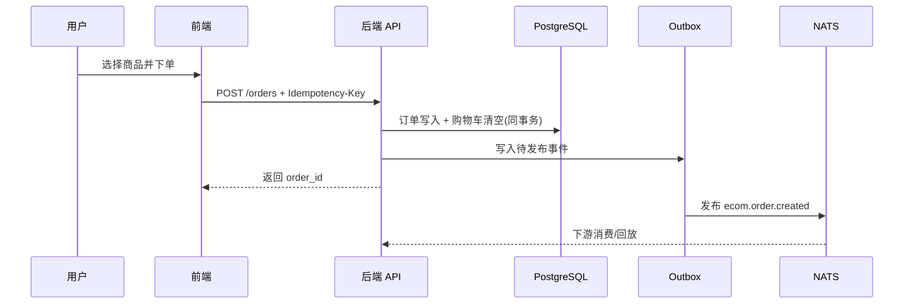
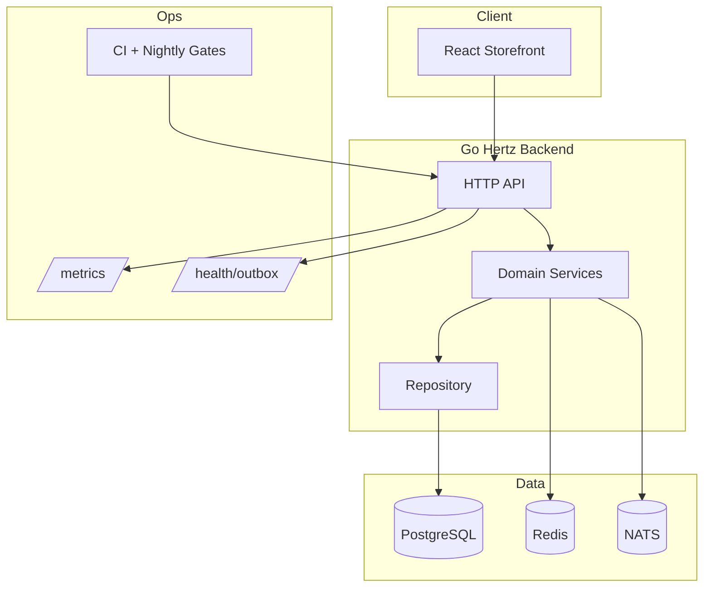
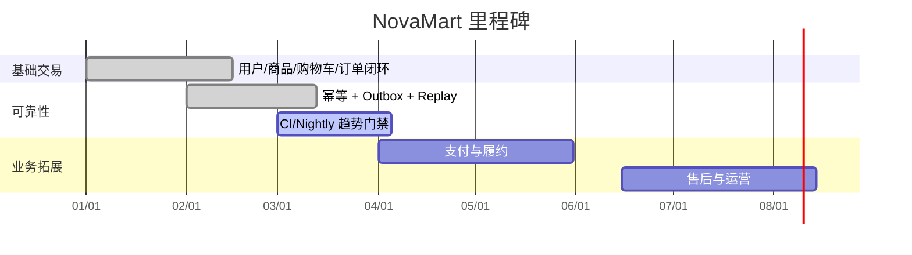

# NovaMart 电商平台

<p align="center">
  
</p>

<p align="center">
  
</p>

<p align="center">
  
  
  
  
  
  
  
</p>

## 视觉总览

| 交易链路 | 可靠性 | 可观测 | 后续拓展 |
|---|---|---|---|
| 注册/登录 | 下单幂等 | `/metrics` | 支付 |
| 商品/购物车 | Outbox | `/health/outbox` | 履约 |
| 下单/订单详情 | Replay 重放 | 审计日志导出 | 售后 |

## 交易时序图



## 架构拓扑图



## 能力看板

```text
[交易闭环]
注册登录  ██████████ 100%
商品浏览  ██████████ 100%
购物车    ██████████ 100%
订单下单  ██████████ 100%

[可靠性]
幂等键保护        ██████████ 100%
Outbox 发布       ██████████ 100%
失败重放/重试      ██████████ 100%
跨任务趋势门禁      ████████░░  80%

[业务扩展]
支付             ███░░░░░░░  30%
履约物流          ██░░░░░░░░  20%
售后             ██░░░░░░░░  20%
```

## 快速启动（3 步）

```bash
cd ecommerce_app
make up
make backend
make frontend
```

访问地址：
- 前端：`http://localhost:5173`
- 健康检查：`http://localhost:8080/health`
- API 基地址：`http://localhost:8080/api/v1`

## 常用操作

```bash
# 质量门禁
make lint
make test
make integration
make build
make scope-check
make frontend-drift-check
```

## 路线图（形象版）



## 目录

```text
ecommerce_app/
├── backend/   # API + 领域服务 + 存储 + 迁移
├── frontend/  # React 商城前端
├── infra/     # docker-compose + 监控配置
├── scripts/   # CI / Nightly 自动化脚本
└── docs/      # 架构、接口、路线图、运行手册
```

## 文档入口

- 架构设计：`docs/ARCHITECTURE.md`
- API 合同：`docs/API_CONTRACT.md`
- 路线图：`docs/ROADMAP.md`
- 迭代记录：`docs/ITERATION_NOTES.md`
