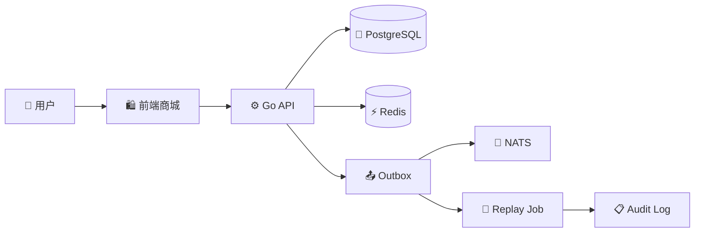
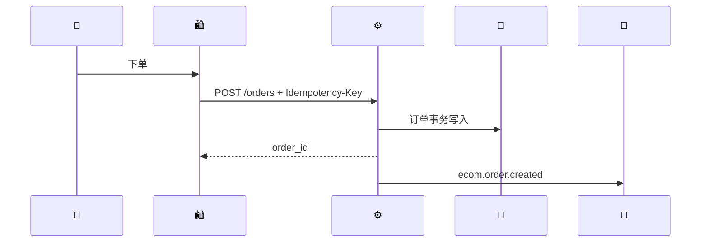

# NovaMart

<p align="center">
  
</p>

<p align="center">
  
</p>

<p align="center">
  
  
  
  
  
  
</p>





<p align="center">
  
</p>

```bash
cd ecommerce_app
make up && make backend && make frontend
```

```text
http://localhost:5173
http://localhost:8080/health
http://localhost:8080/api/v1
```
