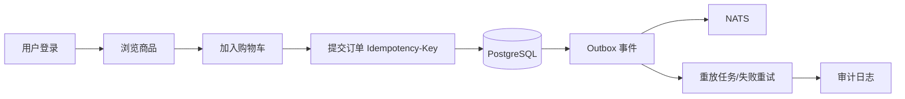

# NovaMart 电商平台

<p align="center">
  
</p>

<p align="center">
  
  
  
  
  
  
</p>

## 一眼看懂

| 模块 | 状态 |
|---|---|
| 用户注册/登录 | ✅ |
| 商品列表 + 缓存 | ✅ |
| 购物车 | ✅ |
| 下单幂等 | ✅ |
| 订单列表/详情/筛选 | ✅ |
| Outbox + 重放任务 | ✅ |
| 审计日志 + 导出 | ✅ |
| Prometheus 指标 | ✅ |
| 支付/履约/售后 | ⏳ |

## 业务流（图）



## 架构图（图）

```mermaid
graph TD
  UI[Frontend React] --> API[Backend Go Hertz]
  API --> PG[(PostgreSQL)]
  API --> R[(Redis)]
  API --> N[NATS]
  API --> M[/metrics]
  API --> O[/health/outbox]
```

## 3 步启动

```bash
cd ecommerce_app
make up
make backend
make frontend
```

访问地址：
- 前端：`http://localhost:5173`
- 健康检查：`http://localhost:8080/health`
- API：`http://localhost:8080/api/v1`

## 常用命令

```bash
# 质量门禁
make lint
make test
make integration
make build
make scope-check
make frontend-drift-check
```

## 目录地图

```text
ecommerce_app/
├── backend/   # API + 服务 + 存储 + 迁移
├── frontend/  # React 商城前端
├── infra/     # docker-compose + 监控配置
├── scripts/   # CI / Nightly 脚本
└── docs/      # 架构、接口、路线图、运行手册
```

## 文档入口

- 架构：`docs/ARCHITECTURE.md`
- 接口：`docs/API_CONTRACT.md`
- 路线图：`docs/ROADMAP.md`
- 迭代记录：`docs/ITERATION_NOTES.md`
